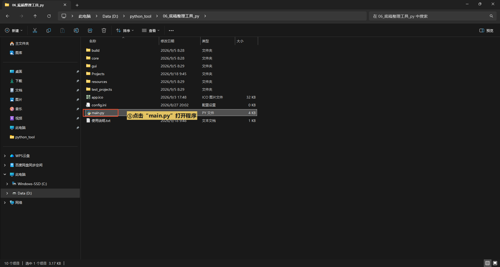
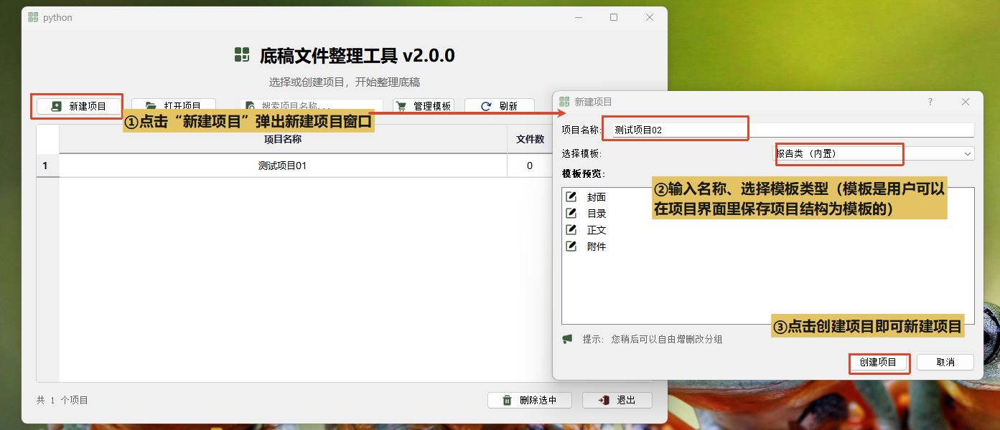
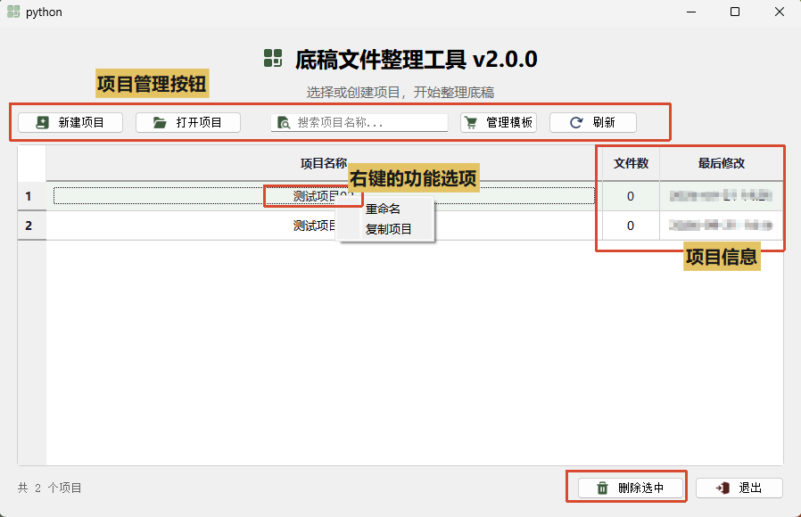
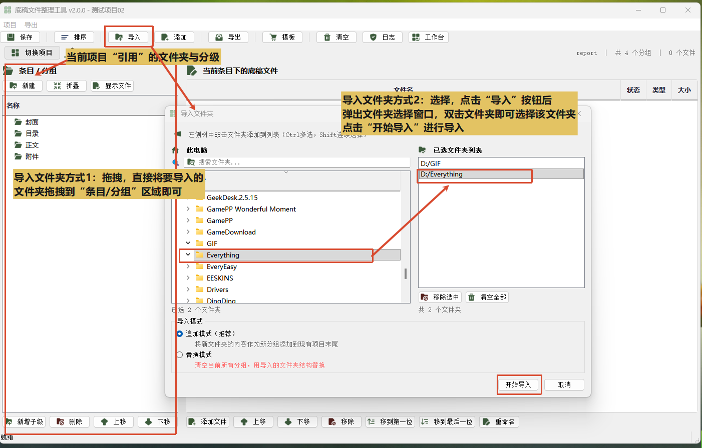
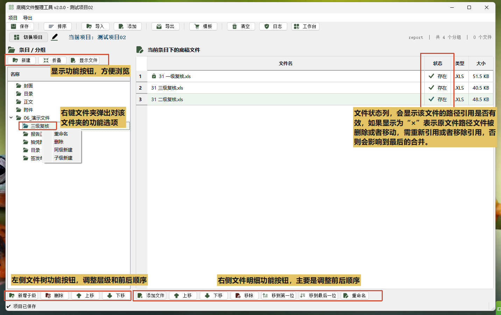
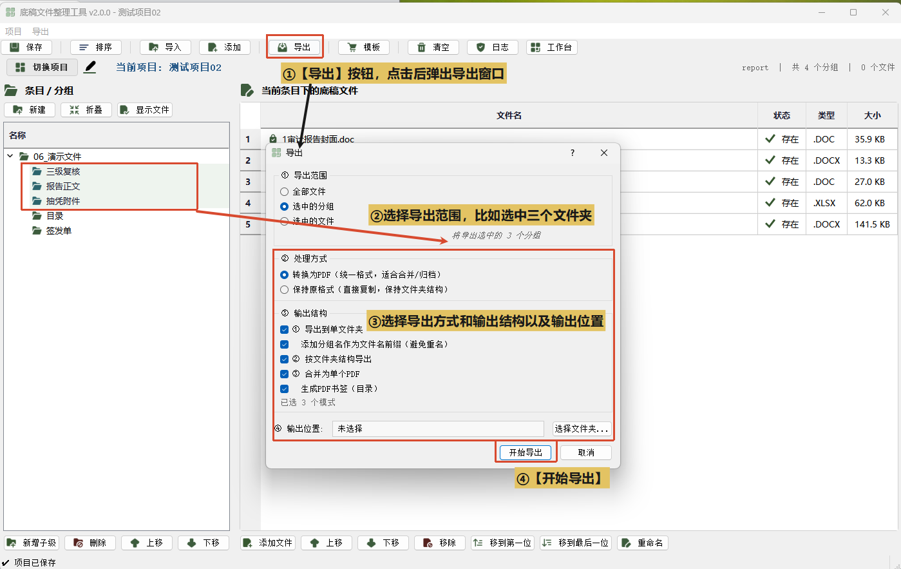

# 底稿文件整理工具

将散落的底稿文件按分组顺序整理，合并导出为带书签目录的 PDF 或分级文件夹，实现文件整理，快速打印。

## 主要功能

- 引用文件路径，不修改原始文件
- 多级分组树管理，支持拖拽排序和分级调整
- 合并导出单个 PDF，自动生成书签目录
- 按分组树导出分级文件夹结构
- 所有文件统一格式输出到一个文件夹
- 选中分组或文件单独导出
- 新建、重命名、复制项目

## 环境要求

- pip install PyQt5 pywin32 PyMuPDF img2pdf olefile pandas numpy openpyxl lxml -i https://pypi.tuna.tsinghua.edu.cn/simple
- Windows 系统、python环境

## 使用步骤

### 1. 打开程序，新建项目

双击【main.py】入口打开软件，进入项目管理窗口。点击【新建项目】输入项目名称选择好模板后即可创建项目。

此外项目管理页面也有项目管理和修改的一些基础功能。

### 2. 导入文件夹/文件

导入文件夹/文件均支持选择导入与拖拽导入：
①拖拽导入：直接从资源管理器把文件或文件夹拖到左侧分组树/右侧文件明细。
②选择导入：点工具栏【导入】（导入文件夹）/【添加】（添加文件），从弹出窗口左侧双击选择文件夹即可。

### 3. 整理分组和顺序

左侧分组树：新建分组/新增子级、重命名、删除、上下箭头调整顺序、拖拽调整层级。
右侧文件表格：添加文件或拖拽导入、上下箭头调整顺序、移到第一位/最后一位、重命名（只改软件内显示名）。

【⭐】文件夹和文件的顺序决定了最后合并导出时的先后顺序

### 4. 导出

点击【导出】选择到处模式（支持多选），选择导出范围（支持选中部分文件夹/文件后导出）有以下三种导出模式：
①导出分级文件夹：按分组树导出成实际目录结构。
②扁平导出：所有文件转换格式后输出到一个文件夹。
③合并为单个 PDF：按分组顺序合并，勾选【生成 PDF 书签】自动生成pdf书签和目录文件。

## 常见问题

**Q: 导出会修改我硬盘上的原始文件吗？**

A: 不会。所有重命名、排序、分组操作只在软件内部记录引用路径，原文件不动。

**Q: 合并 PDF 后书签目录怎么生成？**

A: 导出时勾选【生成PDF书签（目录）】选项，软件会按分组层级自动生成书签。

**Q: 支持哪些文件格式？**

A: PDF、Word、Excel、图片

